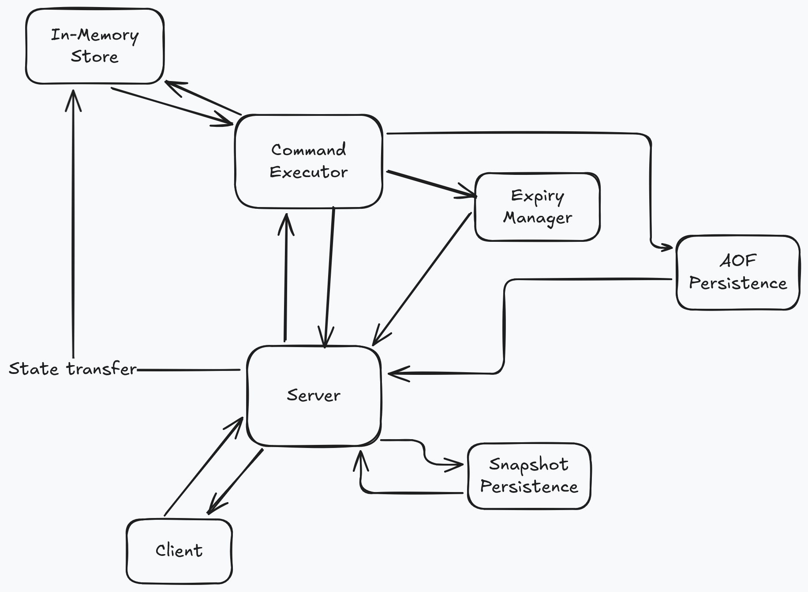

# baby-redis


A from-scratch implementation of a Redis-inspired in-memory key-value store,
built in Java as a deep dive into network protocols, data structures, and
systems programming.

## Architecture


## Recent updates
- **0.4.0**: 
  - Decoupled `InMemoryStore` from `SnapshotManager` — store no longer knows about persistence.
  - Append-Only File (AOF) persistence with sequential command logging.

- **0.3.0**: Added FLUSHDB command with support for full and pattern-based (prefix*) key deletion. Enhanced KEYS command to support prefix-based pattern matching (KEYS prefix*).

- **0.2.0**: Implemented RESP-inspired wire protocol for typed client-server communication.

## Status

**Taking a break** Core functionality and persistance works. Taking a break to focus on work and studies.

## Features

- TCP server accepting concurrent client connections
- RESP-inspired wire protocol for typed client-server communication
- Hybrid persistence:
    - **RDB-style snapshots** — periodic + shutdown saves with atomic temp-file-then-rename
    - **Append-Only File (AOF)** — sequential command logging with sequence tracking
    - **Hybrid recovery** — load snapshot, then replay AOF commands after snapshot's sequence number
- Supported commands:
    - **Strings:** `GET`, `SET`, `DELETE`
    - **Sets:** `SADD`, `SREM`, `SISMEMBER`, `SMEMBERS`
    - **Expiry:** `EXPIRE`, `EXPIREAT`, `TTL`
    - **Key management:** `KEYS` (supports `*` and `prefix*` patterns), `FLUSHDB` (supports full and pattern-based flush)
    - **Test:** `PING`

## Project Structure

The baby-redis ecosystem consists of four independent repositories:

- [baby-redis](https://github.com/mariusflores/baby-redis) — the server
- [baby-redis-client](https://github.com/mariusflores/baby-redis-client) — the Java client library
- [baby-redis-cli](https://github.com/mariusflores/baby-redis-cli) — the command-line interface
- [baby-redis-protocol](https://github.com/mariusflores/baby-redis-protocol) — shared RESP protocol library

## Getting Started

### Prerequisites

- Java 21+
- Maven
- Docker (optional)
- [baby-redis-protocol](https://github.com/mariusflores/baby-redis-protocol) installed locally

### Building from source

```bash
git clone https://github.com/mariusflores/baby-redis.git
cd baby-redis
mvn clean package
```

### Running the Server

**With Java:**

```bash
java -jar target/baby-redis.jar
```

**With Docker (build locally):**

```bash
docker build -t baby-redis .
docker run -p 6379:6379 baby-redis
```

**With Docker (from Docker Hub):**

```bash
docker pull mfloresdal/baby-redis
docker run -p 6379:6379 mfloresdal/baby-redis
```

The server listens on port `6379` by default.

## Roadmap

- [x] Implement RESP-inspired wire protocol for typed
  responses [#2](https://github.com/Mariusflores/baby-redis/issues/2)
- [x] Add Logging framework [#3](https://github.com/Mariusflores/baby-redis/issues/3)
- [x] Add FLUSHDB command with pattern-based and full flush support
- [x] Enhance KEYS command to support prefix-based pattern matching
- [x] Build personal tools on top of the ecosystem (expense tracker, dashboard)
- [x] Hybrid persistence (RDB snapshots + AOF with sequence tracking)
- [x] Decouple persistence from store (dependency injection, interfaces)
- [x] Extract CommandExecutor and ExpiryManager from server
- [ ] Configurable persistence mode (snapshot only / AOF only / hybrid)
- [ ] Pub/Sub support
- [ ] List operations (`LPUSH`, `LPOP`)
- [ ] Eviction policies

## Related

- [baby-redis-client](https://github.com/Mariusflores/baby-redis-client) — Java Library handling socket connections to
  baby redis server
- [baby-redis-cli](https://github.com/Mariusflores/baby-redis-cli) — Devtool using this library to connect to server and
  perform command line operations
- [baby-redis-protocol](https://github.com/mariusflores/baby-redis-protocol) — shared RESP protocol library
- [expense-tracker](https://github.com/mariusflores/expense-tracker) — a personal tool to track economy and spending trends. Uses baby-redis for data storage.
- [energy-monitor](https://github.com/mariusflores/energy-monitor) — a personal tool to show energy-prices taken from public API. still early development. Uses baby-redis to cache energy-price data
- [sensor-data-simulator](https://github.com/mariusflores/sensor-data-pipeline) — smart meter data pipeline simulator sending concurrent readings to baby-redis

  

